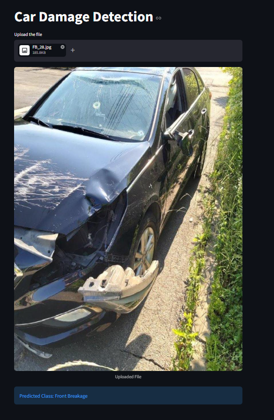

# 🚗 Car Damage Detection and Classification

[](https://www.python.org/)
[](https://pytorch.org/)
[](https://fastapi.tiangolo.com/)
[](https://streamlit.io/)

A complete, end-to-end Deep Learning system designed to identify and classify vehicle damage from images. Leveraging **Transfer Learning with ResNet-50** in PyTorch, the system distinguishes between front and rear vehicle perspectives and classifies them into different levels/types of damages.

The project features a full lifecycle:
1. **Model Training & Notebooks**: Training script/notebook utilizing PyTorch to fine-tune ResNet-50.
2. **FastAPI Backend**: A high-performance API server to serve model predictions asynchronously.
3. **Streamlit Frontend**: An interactive, user-friendly web interface allowing users to upload car images and get real-time prediction feedback.

---

## Project Architecture & Structure

The repository is organized into three main components:

```text
damage-prediction/
├── fastapi-server/          # FastAPI backend server
│   ├── model/               # Model folder housing the saved weights
│   │   └── saved_model.pth  # Fine-tuned ResNet-50 model state dict (~94MB)
│   ├── model_helper.py      # Core PyTorch model definition and inference function
│   ├── requirements.txt     # Backend specific python packages
│   └── server.py            # FastAPI main application and routing
├── streamlit-app/           # Streamlit web frontend
│   ├── model/               # Model folder housing the saved weights
│   │   └── saved_model.pth  # Fine-tuned ResNet-50 model state dict
│   ├── app.py               # Streamlit application UI & frontend logic
│   ├── app_screenshot.png   # Frontend screenshot
│   ├── model_helper.py      # Core PyTorch model definition and inference function
│   ├── requirements.txt     # Frontend specific python packages
│   └── README.md            # Streamlit-specific documentation
├── training/                # Deep Learning training pipeline
│   ├── dataset/             # Organized raw dataset
│   │   ├── F_Breakage/      # Front Breakage images
│   │   ├── F_Crushed/       # Front Crushed images
│   │   ├── F_Normal/        # Front Normal images
│   │   ├── R_Breakage/      # Rear Breakage images
│   │   ├── R_Crushed/       # Rear Crushed images
│   │   └── R_Normal/        # Rear Normal images
│   ├── damage_prediciton_prj.ipynb  # Jupyter Notebook used for model training & evaluation
│   └── saved_model.pth      # Outputs of training pipeline
└── .gitignore               # Ignored build/system files
```

---

## Model Training & Performance

The model utilizes **Transfer Learning** on a pre-trained **ResNet-50** architecture. The training process involves freezing the early feature extraction layers and fine-tuning the deep residual layers (specifically `layer4`) and the final fully connected layers to fit the custom car damage classification task.

### Dataset Overview
- **Total Images**: ~1,700 images of vehicle third-quarter views (front/rear).
- **Target Classes (6 total)**:
  - `Front Breakage` / `F_Breakage`
  - `Front Crushed` / `F_Crushed`
  - `Front Normal` / `F_Normal` (Undamaged)
  - `Rear Breakage` / `R_Breakage`
  - `Rear Crushed` / `R_Crushed`
  - `Rear Normal` / `R_Normal` (Undamaged)

### Performance
- **Validation Accuracy**: ~**80%**
- **Architecture Highlights**: Includes a fully custom fully connected (`fc`) layer with a `Dropout` probability of `0.2` to prevent overfitting, mapping the 2048-dimensional features to the 6 target classes.

---

## 🚀 Quick Start Guide

You can run this project in two ways:
1. **Monolithic App (Streamlit Frontend + Embedded Inference)**: The Streamlit app runs inference directly by importing the model helper and loading `saved_model.pth`.
2. **Client-Server Architecture (FastAPI Server + Frontend client)**: You can spin up the FastAPI server to handle predictions via API requests and interact with it programmatically or build custom frontends.

### Prerequisites
- Python 3.8+ installed.
- CUDA-compatible GPU is optional (model will run on CPU by default if GPU is not available/configured).

### Setup and Running the Streamlit App

1. Navigate to the `streamlit-app` directory:
   ```bash
   cd streamlit-app
   ```
2. Install the necessary dependencies:
   ```bash
   pip install -r requirements.txt
   ```
3. Run the Streamlit application:
   ```bash
   streamlit run app.py
   ```
4. Open the displayed URL (usually `http://localhost:8501`) in your browser to interact with the application.

### Setup and Running the FastAPI Server

1. Navigate to the `fastapi-server` directory:
   ```bash
   cd fastapi-server
   ```
2. Install the necessary dependencies:
   ```bash
   pip install -r requirements.txt
   ```
3. Run the API server using Uvicorn:
   ```bash
   # Make sure uvicorn is installed (pip install uvicorn)
   pip install uvicorn
   uvicorn server:app --host 127.0.0.1 --port 8000 --reload
   ```
4. The interactive API documentation will be available at `http://127.0.0.1:8000/docs`.

---

## Streamlit App Preview

Below is a preview of the interactive Streamlit user interface:



---

## Requirements & Dependency Overview

The system relies on PyTorch and Torchvision for neural network construction and inference, PIL for image preprocessing, and either Streamlit or FastAPI for interface deployment.

- **Deep Learning**: `torch`, `torchvision`
- **Image Processing**: `pillow`
- **Web App / Serving**: `streamlit`, `fastapi`, `uvicorn` (for FastAPI serving)
