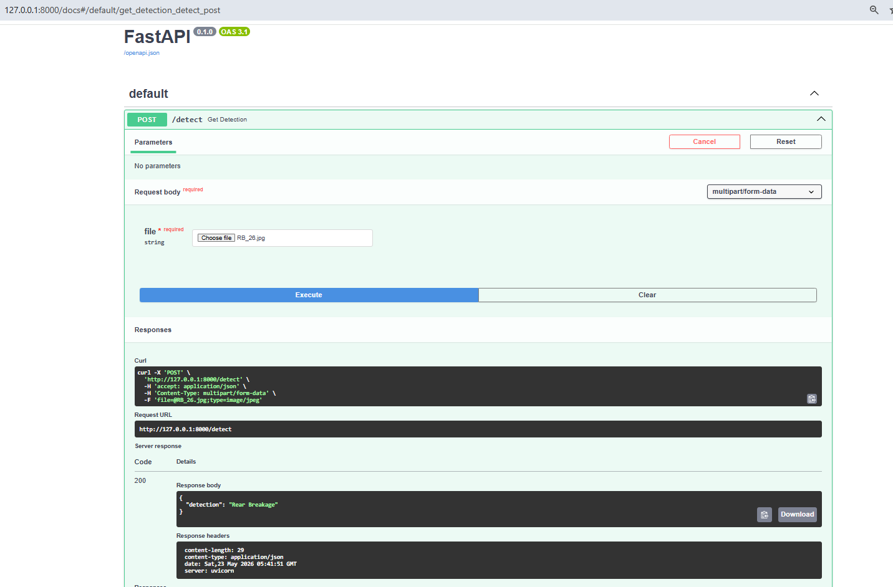

# Car Damage Detection - FastAPI Server

This directory contains the high-performance **FastAPI backend** for serving the Car Damage Detection model. It exposes a simple API endpoint (`/detect`) where developers and external services can upload car images and receive structural classification predictions in real time.

## Features

- **Blazing Fast Endpoint**: Uses FastAPI's asynchronous routing capabilities.
- **Robust Deep Learning Inference**: Uses PyTorch backend with a pre-trained and fine-tuned ResNet-50 network.
- **Easy Swagger UI Integration**: Built-in interactive OpenAPI docs ready out-of-the-box.

---

## Directory Structure

```text
fastapi-server/
├── model/
│   └── saved_model.pth   # Fine-tuned ResNet-50 weights (~94MB)
├── model_helper.py       # PyTorch Model architecture & image preprocessing
├── requirements.txt      # API dependencies
└── server.py             # FastAPI entry point & API route definition
```

---

## Installation & Setup

1. **Navigate to this folder**:
   ```bash
   cd fastapi-server
   ```

2. **Install Dependencies**:
   It is recommended to use a virtual environment:
   ```bash
   pip install -r requirements.txt
   ```
   *Note: In addition to the packages inside `requirements.txt`, you will need an ASGI server (like `uvicorn`) to run the app.*
   ```bash
   pip install uvicorn
   ```

3. **Start the Server**:
   Launch the FastAPI app with Uvicorn:
   ```bash
   uvicorn server:app --host 127.0.0.1 --port 8000 --reload
   ```

4. **Verify Deployment**:
   Open your browser and navigate to `http://127.0.0.1:8000/docs` to see the interactive Swagger UI.

---

## API Documentation & Usage

### 1. Damage Detection Endpoint

* **Endpoint**: `/detect`
* **Method**: `POST`
* **Content-Type**: `multipart/form-data`
* **Payload**: `file` (Binary Image File - `.jpg` or `.png`)

#### Sample Request (`curl`):
```bash
curl -X POST "http://127.0.0.1:8000/detect" \
  -H "accept: application/json" \
  -H "Content-Type: multipart/form-data" \
  -F "file=@/path/to/your/car_image.jpg"
```

#### Sample Request (`Python`):
```python
import requests

url = "http://127.0.0.1:8000/detect"
file_path = "path/to/your/car_image.jpg"

with open(file_path, "rb") as f:
    files = {"file": f}
    response = requests.post(url, files=files)

print(response.json())
```

#### Successful Response (`200 OK`):
```json
{
  "detection": "Front Crushed"
}
```

#### Error Response:
```json
{
  "error": "Detailed error message explanation here"
}
```

---

## Supported Classes

The underlying PyTorch ResNet-50 classifier will return one of the following 6 damage predictions:

| Prediction Class | Description |
| :--- | :--- |
| **`Front Normal`** | No visible damage on the front side of the car. |
| **`Front Breakage`** | Broken or fractured front bumper, grille, or headlights. |
| **`Front Crushed`** | Significant deformation or crash impact damage on the front side. |
| **`Rear Normal`** | No visible damage on the rear side of the car. |
| **`Rear Breakage`** | Broken or fractured rear bumper, trunk area, or taillights. |
| **`Rear Crushed`** | Significant deformation or rear-end collision impact. |
